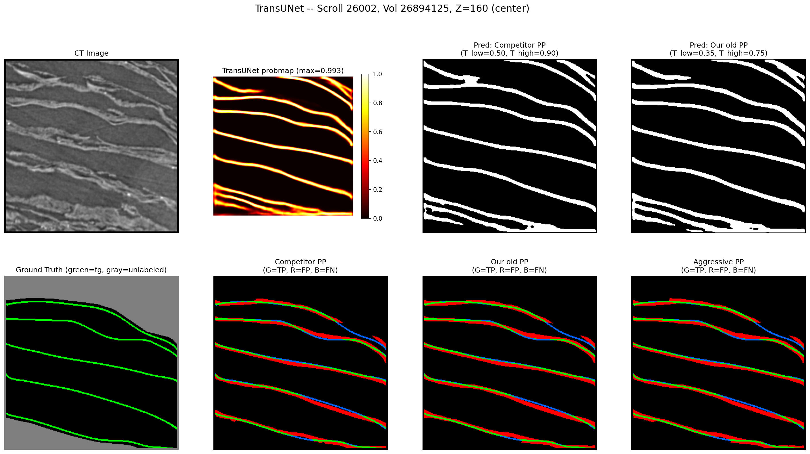
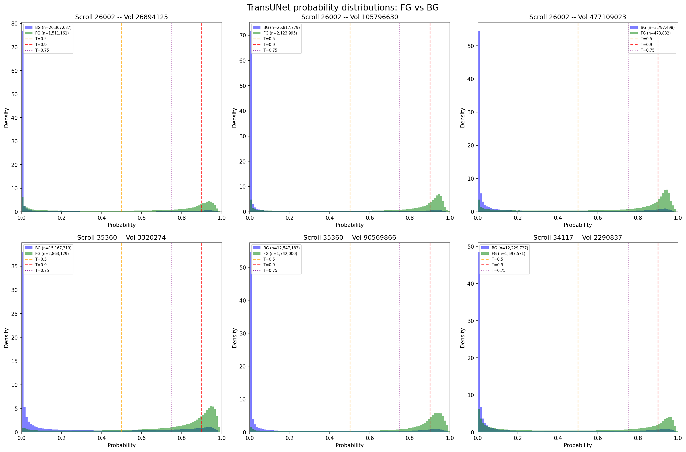
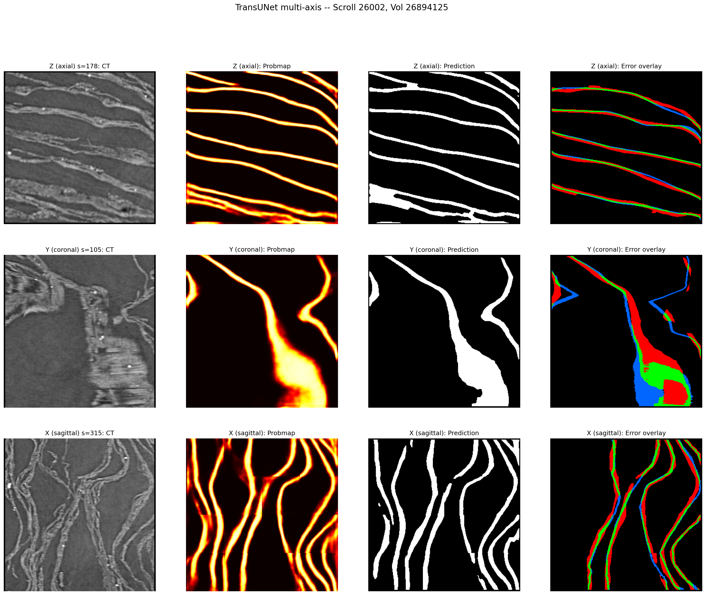
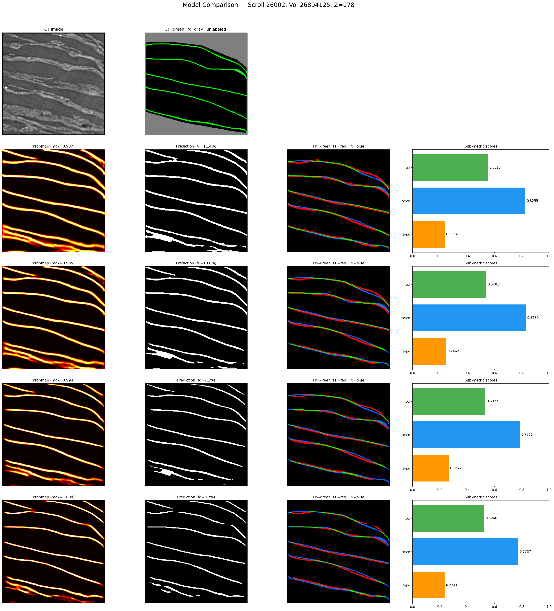
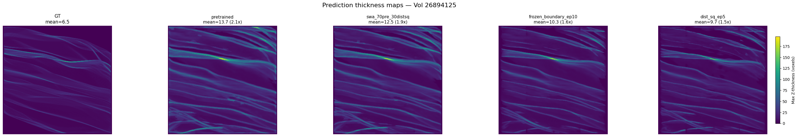
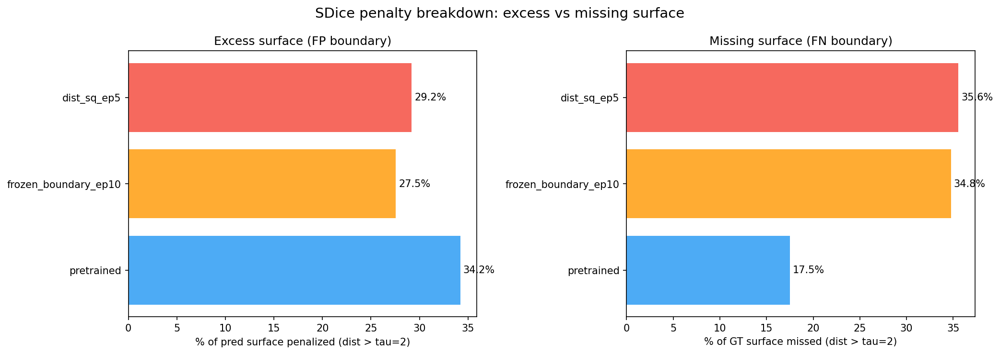
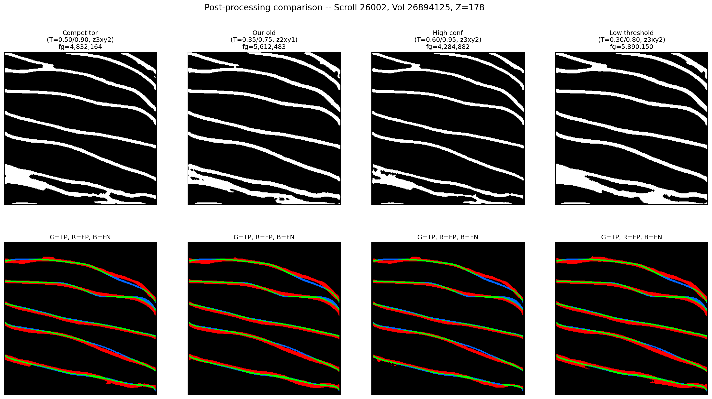

# My First Kaggle Competition: Three Weeks Detecting Ancient Papyrus Surfaces

I entered [the Vesuvius Surface Detection competition](https://www.kaggle.com/competitions/vesuvius-challenge-surface-detection) on February 5th, 2026 — twenty-two days before the deadline of a four-month competition. I'd never done a Kaggle competition before. I'd taken both parts of the fast.ai course and read plenty of papers, but this was my first time applying any of it in practice. I finished 885th out of 1,427 teams with a private score of 0.506. This post covers what I tried, what I learned, and where I went wrong.

## The Problem

In 79 AD, Mount Vesuvius buried the city of Herculaneum under volcanic ash, carbonizing an entire library of papyrus scrolls. Researchers are now using CT scanning to peer inside these scrolls without unrolling them. The competition task: given 3D CT volumes (320×320×320 voxels), detect the surfaces of papyrus sheets within each scan. The surfaces are thin, curved, sometimes stacked in layers, and they occupy only 2–8% of each volume. The competition metric is a weighted combination of three scores: topological accuracy (do you find the right number of surfaces?), surface distance (are your surfaces in the right place?), and variation of information (do your connected components match the ground truth?). It's a 3D semantic segmentation problem, but with a scoring function that rewards structural correctness, not just per-voxel accuracy.

*A single slice through a CT volume. Top-left: the raw CT scan, where papyrus surfaces appear as bright curved lines. Bottom-left: ground truth annotation with each surface colored differently. The task is to go from one to the other — detecting thin, curved, closely-stacked surfaces in 3D.*

## Phase 1: Building from Scratch (Feb 5–16)

I started the way fast.ai teaches: build a simple model, get a training loop working, iterate. My first model was a vanilla 3D U-Net (22.6M parameters, BatchNorm, mixed precision). I used `lr_find` to pick a learning rate, one-cycle scheduling, and a 50/50 mix of binary cross-entropy and Dice loss. It scored **0.331** on the public leaderboard.

Over the next nine runs, I worked through a series of changes:

- **GroupNorm** instead of BatchNorm (better for small batch sizes — 3D volumes limit you to batch_size=2)
- **SegResNet** from MONAI with pretrained [SuPreM](https://github.com/MrGiovanni/SuPreM) weights (2,100 CT volumes, 25 organ classes) — 4.7M parameters instead of 22.6M
- **clDice loss** — centerline Dice computes a soft skeleton of both prediction and ground truth using iterative morphological erosion, then measures skeleton overlap. It penalizes broken surface continuity, not just missing voxels.
- **Boundary loss** — penalizes predictions based on their signed distance from the ground truth surface, directly targeting the SurfaceDice component of the metric
- **Foreground-biased sampling** — 50% of training patches centered on foreground voxels, since surfaces are only 2–8% of each volume
- **Discriminative learning rates** — pretrained encoder layers trained at 1/100th the head learning rate

The `lr_find` utility from fast.ai consistently picked learning rates ~100x too aggressive for pretrained models. One-cycle scheduling's warmup phase was also counterproductive when fine-tuning — productive learning only happened during the cosine annealing phase.

By Run 9, I had a SegResNet scoring **0.570 on local validation** and **0.398 on the public leaderboard**.

### Key discovery: inference pipeline matters more than training

While building a proper evaluation script, I changed two things about inference: uniform sliding window weighting → **Gaussian weighting** (center of each patch weighted higher, since edges have less context), and probability-space TTA averaging → **logit-space averaging**.

Same model weights. No retraining. The mean competition score on five validation volumes went from **0.307 to 0.498**. A 62% improvement from inference alone. This reframed how I thought about the problem — the gap between my training-loop metrics and actual performance was dominated by the inference pipeline, not the model.

*Foreground (green) vs background (purple) probability distributions across six volumes. The distributions overlap heavily in the 0.3–0.6 range — where you set the threshold matters enormously. Gaussian weighting and logit-space TTA sharpened these distributions, pushing more voxels toward 0 or 1 and making the threshold choice less fragile.*

### Key discovery: metric downsample inflation

I'd been computing the competition metric at 4x downsampled resolution (80³ instead of 320³) to save time. The topological scoring computes Betti numbers — counts of connected components, tunnels, and cavities — which is expensive at full resolution. Downsampling inflated scores by +0.16:

| Resolution | Mean Score | Inflation |
|-----------|-----------|-----------|
| Full (320³) | 0.411 | — |
| 2x down (160³) | 0.504 | +0.09 |
| 4x down (80³) | 0.570 | **+0.16** |

My "0.57 local score" was actually ~0.41 at the resolution Kaggle uses. After this, all evaluation ran at full resolution.

## Phase 2: The TransUNet Pivot (Feb 16–19)

Around February 16th I systematically studied what the top competitors were doing. I downloaded and analyzed several public notebooks from the leaderboard.

Every top-scoring entry used the same architecture: **TransUNet with an SEResNeXt50 encoder**, implemented in a library called `medicai` running on Keras 3 with a JAX backend. The model has a convolutional encoder pretrained on ImageNet, a Vision Transformer bottleneck for global context, and a U-Net-style decoder. Around 55 million parameters. The top public notebook scored 0.552 with this architecture.

I switched. I installed Keras 3 with `medicai`, downloaded the pretrained TransUNet weights from Kaggle, and rebuilt my inference pipeline. The pretrained model — without any fine-tuning — scored **0.504 on the public leaderboard** using a dual-stream inference approach adapted from the top notebook. Switching to community-trained weights on the dominant architecture was worth more than all the training experiments I'd run in the previous ten days.

*TransUNet predictions viewed from three axes. The axial view (top) shows clean surface detection, but the coronal and sagittal views reveal thick, blobby predictions — the model predicts surfaces 3–5x thicker than ground truth. This thickness problem drove most of the fine-tuning work in Phase 3.*

### The normalization bug

Then I tried to fine-tune the TransUNet, and every run degraded the model. Competition score dropped from 0.535 to the 0.26–0.34 range regardless of learning rate, loss function, or freezing strategy.

After two days I found the root cause. The pretrained model had been trained in two stages by different people:

- **Stage 1** (TPU): z-score normalization — subtract mean, divide by standard deviation, producing values centered around zero
- **Stage 2** (GPU fine-tuning): divide-by-255 normalization — scaling pixel values to [0, 1]

My training code used divide-by-255. My inference code used z-score (matching `medicai`'s default). The model learned one distribution during training and saw a different one at test time.

A second bug compounded the first: the intensity augmentation (random brightness shifts of ±0.15) was applied to 0–255 values, which after divide-by-255 became ±0.0006 — effectively no augmentation at all.

Fixing both issues (z-score training normalization, proper augmentation range) stopped the degradation. But fine-tuned models still couldn't beat the pretrained baseline on the competition metric.

## Phase 3: Fine-Tuning and SWA Blending (Feb 19–25)

Fine-tuning improved some metric components but degraded others. Specifically, topology-aware losses (distance-based penalties, boundary losses) produced thinner, more topologically correct predictions — but at the cost of **SurfaceDice**, which measures how closely the predicted surface matches ground truth position. The pretrained model had strong spatial precision that fine-tuning eroded.

I also found that **freezing the encoder** (training only the decoder and prediction head, ~6M of 55M parameters) consistently outperformed discriminative learning rates. The pretrained features were good enough that updating them with limited data and time only added noise.

| Model | Best Comp | Topo | SDice | Strategy |
|-------|-----------|------|-------|----------|
| frozen_boundary | 0.5408 | **0.2642** | 0.7871 | Frozen encoder |
| frozen_dist_sq | 0.5402 | 0.2634 | 0.7885 | Frozen encoder |
| discrim_boundary | 0.5286 | 0.2342 | 0.7836 | Discriminative LR |
| discrim_dist_sq | 0.5269 | 0.2292 | 0.7841 | Discriminative LR |
| **pretrained** | **0.5526** | 0.2354 | **0.8255** | No training |

None of the fine-tuned models beat pretrained on the composite score.

*Visual comparison of pretrained vs. fine-tuned models on the same slice. Each row shows: probability heatmap, binary prediction, error overlay (green=TP, red=FP, blue=FN), and sub-metric scores. Fine-tuned models (rows 3–4) produce thinner predictions with better topology but more blue (missed surface) — the SDice tradeoff that SWA blending was designed to solve.*

### SWA blending

The approach that finally worked was **Stochastic Weight Averaging (SWA)** — blending pretrained and fine-tuned weights in parameter space. 70% pretrained + 30% fine-tuned, applied to every parameter in the network. The pretrained model contributes spatial precision; the fine-tuned model contributes topological improvements; the blend gets both.

| Model | Comp | Topo | SDice |
|-------|------|------|-------|
| pretrained (baseline) | 0.5526 | 0.2354 | 0.8255 |
| swa_90pre_10topo | 0.5544 | 0.2403 | 0.8285 |
| **swa_70pre_30topo_ep5** | **0.5549** | 0.2499 | 0.8291 |
| swa_60pre_40topo | 0.5541 | 0.2507 | 0.8287 |
| **swa_70pre_30margin_dist_ep5** | **0.5551** | — | 0.8299 |

The 70/30 ratio was consistently the sweet spot. The result was stable across different fine-tuned models — nearly every 70/30 blend landed in the 0.553–0.555 range regardless of which loss function produced the fine-tuned weights.

*Thickness maps across models. Ground truth (far left) has mean thickness ~6.5 voxels. The pretrained model averages ~13.7 (2.1x too thick). Fine-tuned models (frozen_boundary, dist_sq) thin slightly but remain ~11–13x. The SWA blend sits between pretrained and fine-tuned — it captures the thinning benefit without losing surface coverage.*

### GPU fleet and overnight pipelines

By this point I was running experiments on six GPUs: my local RTX 5090 for evaluation, four rented RTX 6000 Ada 48GB machines for training, and one for external data processing. I worked with claude.ai throughout the competition for writing training scripts, managing remote infrastructure, and debugging. The GPU fleet management is where Claude was most useful — writing bash chains that ran training → evaluation → checkpoint syncing, managing tmux sessions across machines, and running as background agents to monitor GPUs overnight.

Every overnight pipeline had a `--dry-run` flag that tested every component on a single volume before committing to a full run. This policy came from experience: a 6-hour training run that fails 10 minutes in because of a missing import is a waste of a night.

The most ambitious pipeline downloaded scroll data from scrollprize.org, generated pseudo-labels using our best model, and trained on the expanded dataset. It didn't improve on our best score (0.5536 vs 0.5551), but the infrastructure worked.

## Dead Ends

**Selective component unfreezing.** The TransUNet has distinct components (CNN encoder, Vision Transformer, decoder, prediction head). I tried unfreezing individual components with targeted losses — e.g., just the ViT with clDice to improve connectivity. Every variant (ViT-only, decoder-only, combined, high LR, balanced losses) underperformed frozen-encoder training.

**Multi-model SWA.** Blending 3–4 fine-tuned models with pretrained weights (instead of one) produced the best SurfaceDice I measured (0.8314) but didn't improve the composite competition score.

**Ridge thinning.** The model's predictions were 3–5x too thick (15–30% foreground vs 2–8% in ground truth). Morphological ridge extraction in post-processing destroyed topology — topological accuracy went from 0.29 to 0.005. Thinning has to happen at training time.

*The fine-tuning dilemma visualized. The pretrained model has the most excess surface (34.2% FP boundary) but the least missing surface (17.5% FN). Fine-tuned models reduce excess thickness but miss more ground truth surface. No single model wins on both axes — this is why SWA blending was necessary.*

**Connectivity-based post-processing.** Four methods, thirty configurations: probability-guided gap filling, dilate-merge-erode, two-pass hysteresis, and a combined approach. None beat simple hysteresis thresholding. The only post-processing parameter that mattered was `T_low` (the low hysteresis threshold), and its optimal value changed with every model.

*Four post-processing configurations on the same slice. Top row: binary predictions. Bottom row: error overlays. Despite very different threshold settings, the error patterns are nearly identical — post-processing moves voxels around at the margins but can't fix the fundamental thickness problem.*

**Refinement model.** A second model trained to clean up the first model's predictions. It improved topology and surface distance but destroyed variation of information. Per-voxel refinement fragments connected components.

## What I Learned

**The gap between coursework and competition is large.** fast.ai gave me the conceptual foundation and framework. But in a course, the data pipeline works and you focus on the model. In a competition, most of the work is everything around the model — evaluation infrastructure, normalization consistency, inference pipelines, post-processing.

**Inference matters as much as training.** Gaussian sliding window inference and logit-space TTA averaging gave me a 62% score improvement without retraining. Full-pipeline evaluation is the only thing that correlates with the leaderboard.

**Training-time metrics can be misleading.** Validation loss went down. Dice went down. The model was "learning." But the competition score got worse because training and evaluation used different normalizations. Verifying that training and inference pipelines match exactly is essential.

**SWA blending works when fine-tuning doesn't.** When fine-tuning improves one metric component but degrades another, blending pretrained and fine-tuned weights in parameter space can capture both. The 70/30 ratio was robust across all my experiments.

## Score Progression

| Milestone | Public Score | What changed |
|-----------|-------------|-------------|
| Run 1: Vanilla 3D U-Net | 0.331 | Baseline |
| Run 3: SegResNet + clDice | 0.348 | Architecture + loss |
| Run 9: Best SegResNet | 0.398 | LR tuning, FG sampling |
| TransUNet pretrained | 0.504 | Architecture pivot |
| Final (SWA blend) | 0.506 (private) | SWA 70/30 blend |

Final placement: **885th out of 1,427 teams.** Top score: 0.607.

